# GenMave Platform - Design Document

## Project Overview

### Vision Statement
GenMave is a digital platform designed for Gen Z individuals who feel lost in their personal and professional journey. The platform provides a safe, judgment-free space for self-discovery, reflection, and skill exploration through psychological assessments, personal journaling, and guided skill development.

### Target Audience
- Primary: Gen Z (ages 18-27+)
- Segments: Students, fresh graduates, young professionals, and individuals in gap years
- Pain Points Addressed:
  - 48% of Gen Z feel lost almost daily
  - 72% are exhausted from comparing themselves to others
  - 76% feel insecure after scrolling social media

### Core Value Proposition
"A space to return to yourself" - GenMave helps users understand themselves better, reflect without judgment, and explore skills without pressure or external expectations.

---

## Platform Objectives

### Primary Goals
1. Enable deep self-understanding through reflective psychological assessments
2. Provide a private, secure space for personal reflection and journaling
3. Guide skill exploration based on personal traits and learning styles
4. Reduce social comparison anxiety and digital overwhelm
5. Build clarity and direction in life choices

### Success Metrics
- User engagement: Daily active users, journal streak consistency
- Self-discovery: Clarity score improvement over time
- Skill exploration: Completion rates of 7-day skill trials
- User satisfaction: Net Promoter Score (NPS), user testimonials
- Retention: Monthly active users, return visit frequency

---

## System Architecture

### High-Level Architecture


### Technology Stack

| Layer | Technology | Purpose |
|-------|-----------|---------|
| Frontend Framework | React | Component-based UI development |
| Styling | Tailwind CSS | Utility-first responsive design |
| Routing | React Router | Client-side navigation |
| Authentication | Supabase Auth | User authentication and session management |
| Database | Supabase PostgreSQL | Data persistence and real-time features |
| Icons | Lucide React | Consistent iconography |
| Charts | Recharts | Data visualization for metrics |
| Fonts | Nunito (headings), Inter (body) | Typography system |

### Design System

**Color Palette:**
- Primary: Sage Green (#81B29A) - Calm, growth, balance
- Secondary: Cream (#F4F1DE) - Warm, safe, neutral
- Accent: Terracotta (#E07A5F) - Energy, action, warmth

**Design Principles:**
- Mobile-first responsive design
- Clean, minimal aesthetic with abundant white space
- Smooth scroll animations and transitions
- Accessibility-compliant contrast ratios
- Non-judgmental, supportive tone in all copy

---

## Core Features

### Feature 1: Landing Page

**Purpose:** First touchpoint to communicate value proposition and convert visitors into users.

**Key Sections:**

| Section | Content | Purpose |
|---------|---------|---------|
| Hero | Headline addressing pain point + CTA | Immediate emotional connection |
| Problem Validation | 3 statistics cards showing Gen Z struggles | Build empathy and relevance |
| Features Overview | 3 feature cards with icons | Communicate core value |
| How It Works | 3-step process visualization | Reduce friction and uncertainty |
| Final CTA | Call-to-action button | Drive conversion |
| Footer | Navigation links | Secondary information access |

**User Journey:**
1. Visitor lands on page
2. Reads relatable headline: "Capek ngebanding-bandingin diri sama orang lain?"
3. Sees validated statistics
4. Understands features and process
5. Clicks "Mulai Psikotes Gratis" CTA
6. Proceeds to signup/login

**Content Strategy:**
- Tone: Conversational, empathetic, Gen Z language
- Headlines: Problem-focused, relatable
- Body copy: Solution-oriented, non-judgmental
- CTAs: Action-oriented, low-commitment language

---

### Feature 2: Authentication System

**Purpose:** Secure user identity management with seamless onboarding experience.

**Components:**

#### Sign Up Flow


**Validation Rules:**

| Field | Validation | Error Message |
|-------|-----------|---------------|
| Email | Valid email format, not already registered | "Email sudah terdaftar" / "Format email tidak valid" |
| Password | Minimum 8 characters | "Password minimal 8 karakter" |
| Confirm Password | Must match password field | "Password tidak cocok" |
| Terms Checkbox | Must be checked | "Kamu harus setuju dengan Terms & Privacy" |

#### Login Flow


#### Session Management

**Behavior:**
- Automatic session check on page load
- If valid session exists → auto-login
- If session expired → redirect to /login
- Session stored in Supabase (server-side)
- Logout clears session and redirects to landing page

**Protected Routes:**
- /dashboard
- /compass
- /journal
- /psikotes (after first completion)
- /skills

**Unprotected Routes:**
- / (landing)
- /login
- /signup
- /about
- /manifesto

---

### Feature 3: Psikotes Multi-Step Assessment

**Purpose:** Comprehensive self-assessment to generate personalized insights and recommendations.

**Assessment Structure:**

| Question # | Topic | Type | Options Count | Purpose |
|-----------|-------|------|---------------|---------|
| 1 | Age | Radio | 4 | Demographic segmentation |
| 2 | Status | Radio | 4 | Life stage context |
| 3 | Feeling Lost Frequency | Radio | 4 | Core pain point measurement |
| 4 | Self-Understanding | Radio Scale | 5 | Baseline clarity assessment |
| 5 | Loss Factors | Checkbox | 8 | Multi-dimensional pain mapping |
| 6 | Brainrot Platform | Radio | 5 | Digital consumption pattern |
| 7 | Post-Scroll Feelings | Checkbox (max 3) | 6 | Emotional impact tracking |
| 8 | Skill Confusion | Radio | 4 | Learning readiness gauge |
| 9 | Learning Obstacles | Checkbox (max 3) | 5 | Barrier identification |
| 10 | Learning Style | Radio | 4 | Educational preference |
| 11 | Community Experience | Radio | 4 | Social comfort level |
| 12 | Sharing Comfort | Radio | 4 | Privacy preference |
| 13 | Primary Need | Radio | 5 | Value alignment |
| 14 | Energy Pattern | Radio | 3 | Chronotype identification |
| 15 | Work Preference | Radio | 3 | Collaboration style |

**User Experience Flow:**


**Data Handling Strategy:**

1. **Temporary Storage (In-Progress):**
   - Use React state for current session
   - Auto-save to localStorage after each answer
   - Restore from localStorage if user returns before completion

2. **Permanent Storage (Completion):**
   - On final submit, POST all answers to Supabase
   - Table: `psikotes_results`
   - Schema:
     - id (UUID, primary key)
     - user_id (UUID, foreign key to auth.users)
     - answers (JSONB, stores all 15 answers)
     - created_at (timestamp)
     - updated_at (timestamp)

3. **Validation:**
   - Cannot proceed without answering required question
   - Checkbox questions enforce max selection limits
   - Back button always enabled (except Question 1)
   - Progress saved on each "Lanjut" click

**Navigation Controls:**

| Button | Availability | Action |
|--------|-------------|--------|
| Lanjut | Enabled when question answered | Proceed to next question + save to localStorage |
| Kembali | Enabled Q2-Q15 | Return to previous question |
| Submit | Question 15 only | Save to Supabase + Generate compass + Redirect |

---

### Feature 4: Personal Compass (Results)

**Purpose:** Transform raw assessment data into actionable, personalized insights that guide self-discovery.

**Compass Components:**

#### A. Hero Greeting
- Personalized: "Halo, [User Name]! Ini Kompasmu 🧭"
- Warm, welcoming tone
- Establishes personal connection

#### B. Personal Narrative Generation

**Narrative Structure Template:**
```
Berdasarkan jawaban kamu, kamu termasuk orang yang:

- [Trait from Q3-Q5: Self-awareness pattern]
  Example: "sering merasa lost dan mencari arah yang lebih jelas"

- [Learning style from Q10]
  Example: "belajar paling efektif dengan hands-on practice"

- [Energy pattern from Q14]
  Example: "paling produktif di malam hari"

- [Values from Q13]
  Example: "butuh memahami diri lebih dalam sebelum mengambil keputusan"

Kamu nggak sendirian dalam perjalanan ini. [Encouraging statement based on community size/similar profiles]
```

**Narrative Logic Mapping:**

| Input Question | Output Trait Category |
|---------------|---------------------|
| Q3 (Feeling lost) + Q4 (Self-understanding) | Self-awareness pattern |
| Q5 (Loss factors) | Core struggles theme |
| Q10 (Learning style) | Educational approach preference |
| Q14 (Energy pattern) | Optimal productivity time |
| Q15 (Solo/Team) | Collaboration preference |
| Q13 (Primary need) | Current life priority |

#### C. Clarity Score Calculation

**Algorithm:**

```
Base Score = 50

Adjustment Factor 1 - Feeling Lost Frequency (Q3):
- "Hampir tiap hari" → -20
- "Seminggu beberapa kali" → -10
- "Kadang-kadang" → 0
- "Jarang" → +20

Adjustment Factor 2 - Self-Understanding (Q4, scale 1-5):
- Score adjustment = (Q4_value - 3) × 10
- Range: -20 to +20

Adjustment Factor 3 - Number of Loss Factors (Q5):
- Score adjustment = -(number_of_checked_factors × 3)
- More factors = lower clarity

Final Score = Base + Factor1 + Factor2 + Factor3
Capped at: 0-100 range
```

**Clarity Score Display:**
- Circular progress gauge (using Recharts)
- Color coding:
  - 0-40: Red/Terracotta (needs support)
  - 41-70: Yellow/Amber (developing clarity)
  - 71-100: Green/Sage (strong clarity)
- Explanation text: "Ini bukan nilai. Ini refleksi seberapa jelas kamu lihat arah hidupmu."

#### D. Energy Pattern Card

**Mapping:**

| Q14 Answer | Icon | Label | Description (from Q15) |
|-----------|------|-------|---------------------|
| Morning person | 🌅 | Morning Person | "Lebih suka kerja [solo/team/flexible]" |
| Night owl | 🌙 | Night Owl | "Lebih suka kerja [solo/team/flexible]" |
| Flexible | 🌓 | Flexible Energy | "Lebih suka kerja [solo/team/flexible]" |

#### E. Learning Style Card

**Mapping:**

| Q10 Answer | Icon | Recommended Resources |
|-----------|------|---------------------|
| Visual | 👁️ | Video tutorials, infographics, design courses |
| Hands-on | ✋ | Interactive labs, project-based learning, workshops |
| Reading | 📖 | Articles, books, documentation, written guides |
| Audio | 🎧 | Podcasts, audio courses, discussion groups |

#### F. Skill Recommendations Engine

**Matching Algorithm:**


**Skill Matching Matrix:**

| User Pattern | Recommended Skill | Match Logic |
|-------------|------------------|------------|
| Visual learner + "nggak tau skill apa" | UI/UX Design | Visual thinking + creative exploration |
| Hands-on + "terlalu banyak pilihan" | Web Development/Coding | Practical, immediate feedback, clear path |
| Reading + "memahami diri" | Psychology/Writing | Deep reflection, structured learning |
| Audio + "komunitas" | Podcasting/Content Creation | Social connection through audio medium |
| "Tekanan ortu" + any style | Life Coaching/Journaling | Self-advocacy and clarity |

**Match Percentage Calculation:**
- Base score: 50%
- +15% if learning style matches skill format
- +15% if skill addresses primary need (Q13)
- +10% if skill addresses top pain point (Q5)
- +10% if energy pattern fits skill demand

**Skill Card Display:**
Each of top 3 skills shown as card:
- Skill name
- Match percentage (e.g., "87% match")
- Why it matches: Brief explanation
- [Coba 7 Hari] button → /skills/[skill-slug]

#### G. Growth Edges

**Purpose:** Gently highlight patterns that may hinder progress, with actionable suggestions.

**Logic Mapping (from Q9):**

| Q9 Answer (Learning Obstacles) | Pattern Identified | Challenge/Tip |
|-------------------------------|-------------------|---------------|
| "Nggak tau mulai dari mana" | Overwhelmed by options | "Challenge: Pick one small step hari ini. Nggak harus sempurna." |
| "Terlalu banyak resources" | Analysis paralysis | "Challenge: Batasi diri cuma 1 resource per minggu." |
| "Nggak ada support" | Isolation | "Challenge: Share progress kamu, even kecil-kecilan, di komunitas." |
| "Cepet bosan" | Low sustained interest | "Challenge: Coba format belajar yang beda dari biasanya." |
| "Nggak ada waktu" | Time management | "Challenge: Start with 15 menit/hari. Consistency > duration." |

**Display:**
- Icon: ⚠️ (non-threatening)
- Tone: Supportive, non-judgmental
- Format: "Kamu cenderung [pattern]. Challenge: [actionable tip]"

#### H. Data Persistence

**Save to Database:**
- Table: `compass_data`
- Schema:
  - id (UUID, primary key)
  - user_id (UUID, foreign key)
  - clarity_score (integer)
  - narrative_text (text)
  - energy_pattern (text)
  - learning_style (text)
  - recommended_skills (JSONB array)
  - growth_edges (JSONB array)
  - created_at (timestamp)
  - psikotes_result_id (UUID, foreign key to psikotes_results)

**CTA:**
- [Ke Dashboard] button → redirect to /dashboard

---

### Feature 5: Dashboard

**Purpose:** Central hub for user activity, progress tracking, and quick navigation.

**Layout Strategy:**
- Responsive grid: 1 column (mobile), 2-3 columns (desktop)
- Card-based design for modularity
- Prioritize most-used actions

**Dashboard Widgets:**

#### Widget 1: Clarity Score Card

**Data Source:** Latest entry from `compass_data` table

**Display Elements:**
- Circular progress indicator (current clarity score)
- Label: "Clarity Score: [X]/100"
- Trend indicator (if multiple compass results exist): ↑ +5 / ↓ -3 / → 0
- [Lihat Compass Lengkap] button → /compass

#### Widget 2: Weekly Reflection Prompt Card

**Data Source:** Randomly selected from `reflection_prompts` table

**Prompt Examples:**
- "Apa yang bikin kamu grateful minggu ini?"
- "Skill apa yang pengen kamu pelajari bulan ini?"
- "Kapan terakhir kali kamu merasa 'ini gue banget'?"
- "Apa yang bikin kamu proud hari ini, sekecil apapun?"

**Display:**
- Prompt text (large, readable)
- [Tulis di Journal] button → /journal (pre-fill with prompt)

#### Widget 3: Journal Streak Card

**Streak Calculation Logic:**
```
Check journal_entries table for user_id:
- Count consecutive days with at least 1 entry
- If today has no entry, streak is "at risk"
- If yesterday had no entry, streak resets to 0

Display:
- Current streak number
- Fire emoji if streak ≥ 3 days
- Motivational message based on streak:
  - 0 days: "Mulai streak hari ini!"
  - 1-2 days: "Bagus! Keep going 🔥"
  - 3-6 days: "Streak kamu on fire! 🔥🔥"
  - 7+ days: "Amazing! X hari berturut-turut! 🔥🔥🔥"
```

**Display:**
- Streak count: "Journal Streak: X hari 🔥"
- [Buka Journal] button → /journal

#### Widget 4: Skill Progress Card

**Conditional Display:**

**If user is exploring a skill:**
- Skill name: "UI/UX Design"
- Progress: "Day 2 of 7"
- Progress bar: 28% filled
- [Lanjutkan] button → /skills/[skill-slug]

**If user is NOT exploring a skill:**
- Message: "Belum mulai explore skill. Yuk mulai!"
- [Explore Skills] button → /skills

**Data Source:** `skill_progress` table
- user_id
- skill_id
- current_day (1-7)
- started_at
- last_activity_at

#### Quick Actions Section

**Buttons:**
- [Retake Psikotes] → /psikotes (with confirmation modal)
- [Explore Skills] → /skills
- [Read Manifesto] → /manifesto

#### Navigation Menu

**Menu Items:**

| Item | Route | Active State |
|------|-------|--------------|
| Dashboard | /dashboard | ● |
| Compass | /compass | ○ |
| Journal | /journal | ○ |
| Skills | /skills | ○ |
| Profile | /profile | ○ |
| Logout | - | Trigger logout action |

**Layout Options:**
- Mobile: Bottom navigation bar
- Desktop: Side navigation bar or top horizontal menu

**Data Fetching Requirements:**

| Widget | Data Source | Query |
|--------|------------|-------|
| Clarity Score | compass_data | SELECT latest by user_id |
| Reflection Prompt | reflection_prompts | SELECT random |
| Journal Streak | journal_entries | COUNT consecutive days by user_id |
| Skill Progress | skill_progress | SELECT by user_id WHERE status = 'active' |

---

### Feature 6: Journal System

**Purpose:** Private, judgment-free space for self-reflection and emotional processing.

**Interface Structure:**

#### Tab 1: Write New Entry

**Form Components:**

| Field | Type | Behavior |
|-------|------|----------|
| Date | Read-only text | Auto-filled with current date (format: "28 Des 2024") |
| Time | Read-only text | Auto-filled with current time (format: "14:35") |
| Content | Large textarea | Placeholder: "Hari ini..." |
| Character Count | Dynamic text | "0 / 2000" (updates on input) |
| Auto-save Indicator | Status text | "Tersimpan" (green) / "Menyimpan..." (gray) |

**Save Mechanisms:**

1. **Auto-save (every 30 seconds):**
   - Trigger: 30-second interval if content changed
   - Action: Silent save to Supabase
   - Feedback: Update indicator to "Menyimpan..." → "Tersimpan"

2. **Manual Save:**
   - Trigger: Click [Simpan] button
   - Action: Immediate save to Supabase
   - Feedback: Success message "Entry disimpan ✅" (toast notification)

3. **Unsaved Changes Warning:**
   - Trigger: User attempts to navigate away with unsaved changes
   - Action: Browser confirmation dialog
   - Message: "Kamu punya perubahan yang belum disimpan. Yakin mau keluar?"

**Buttons:**
- [Simpan] → Manual save + success feedback
- [Batal] → Clear textarea + confirmation modal

#### Tab 2: Past Entries

**Entry List Display:**

```mermaid
graph TD
    A[Fetch all entries for user] --> B[Sort by created_at DESC]
    B --> C[Display as card list]
    
    C --> D[Entry Card]
    D --> E[Date: "28 Des 2024"]
    D --> F[Preview: First 100 chars + "..."]
    D --> G[Baca Selengkapnya button]
    
    G --> H[Open Modal]
    H --> I[Full Entry Content]
    H --> J[Edit button]
    H --> K[Hapus button]
    
    J --> L[Load into Write Tab]
    K --> M[Confirmation Modal]
    M --> N[Delete from DB]
```

**Entry Card Structure:**

| Element | Content | Interaction |
|---------|---------|------------|
| Date | "28 Des 2024" | Visual anchor |
| Preview | First 100 characters of entry + "..." | Glimpse of content |
| [Baca Selengkapnya] | Button | Opens modal with full entry |

**Entry Actions (in modal):**

1. **Edit:**
   - Click [Edit] button
   - Load entry content into Write tab
   - Switch to Write tab
   - Update entry on save (UPDATE instead of INSERT)

2. **Delete:**
   - Click [Hapus] button
   - Show confirmation modal: "Yakin mau hapus entry ini? Aksi ini nggak bisa dibatalin."
   - If confirmed → DELETE from database
   - Show success: "Entry dihapus"
   - Refresh entry list

**Empty State:**
- Displayed when user has 0 journal entries
- Message: "Belum ada journal entry. Mulai tulis hari ini! ✍️"
- [Mulai Menulis] button → Switch to Write tab

**Privacy Notice:**
- Displayed at top of journal page
- Message: "🔒 Semua yang kamu tulis di sini private. Nggak ada yang baca kecuali kamu."
- Purpose: Build trust and encourage honest reflection

#### Technical Implementation

**State Management:**
- Use React useState for textarea content management
- Track dirty state (unsaved changes)
- Manage auto-save timer with useEffect
- Control modal visibility states

**Auto-Save Logic:**

```
Implementation Flow:

1. Initialize state:
   - content (string)
   - lastSaved (timestamp)
   - isSaving (boolean)
   - isDirty (boolean)

2. On content change:
   - Set isDirty = true
   - Reset 30-second timer

3. Auto-save trigger (every 30 seconds):
   - Check if isDirty === true
   - If yes:
     * Set isSaving = true
     * Call Supabase UPDATE/INSERT
     * On success:
       - Set isDirty = false
       - Set isSaving = false
       - Update lastSaved timestamp
     * On error:
       - Keep isDirty = true
       - Show error message
       - Retry after 10 seconds

4. Manual save:
   - Immediate save to Supabase
   - Show toast notification: "Entry disimpan ✅"
   - Set isDirty = false

5. Navigation guard:
   - Before route change, check isDirty
   - If true, show browser confirmation
   - Message: "Kamu punya perubahan yang belum disimpan. Yakin mau keluar?"
```

**Component Architecture:**

| Component | Responsibility |
|-----------|---------------|
| Journal.jsx | Main container, tab switching, data fetching |
| WriteTab.jsx | New entry form, auto-save logic, textarea management |
| PastEntriesTab.jsx | Entry list display, pagination |
| EntryCard.jsx | Individual entry preview card |
| EntryModal.jsx | Full entry view with edit/delete actions |
| ConfirmModal.jsx | Reusable confirmation dialog |

**Supabase Integration:**

**CRUD Operations:**

| Operation | Trigger | Query Pattern |
|-----------|---------|---------------|
| CREATE | First save of new entry | INSERT INTO journal_entries (user_id, content) VALUES (auth.uid(), $content) |
| READ (List) | Load Past Entries tab | SELECT id, content, created_at FROM journal_entries WHERE user_id = auth.uid() ORDER BY created_at DESC LIMIT 20 |
| READ (Single) | Open entry modal | SELECT * FROM journal_entries WHERE id = $id AND user_id = auth.uid() |
| UPDATE | Edit existing entry | UPDATE journal_entries SET content = $content, updated_at = NOW() WHERE id = $id AND user_id = auth.uid() |
| DELETE | Delete entry action | DELETE FROM journal_entries WHERE id = $id AND user_id = auth.uid() |

**Row Level Security (RLS) Policies:**

```
Policy Name: "Users can view their own entries"
Operation: SELECT
Condition: user_id = auth.uid()

Policy Name: "Users can insert their own entries"
Operation: INSERT
Condition: user_id = auth.uid()

Policy Name: "Users can update their own entries"
Operation: UPDATE
Condition: user_id = auth.uid()

Policy Name: "Users can delete their own entries"
Operation: DELETE
Condition: user_id = auth.uid()
```

**Error Handling:**

| Error Scenario | User Feedback | Recovery Action |
|---------------|---------------|----------------|
| Network failure during auto-save | "Koneksi terputus. Akan dicoba lagi..." | Retry after 10 seconds, keep content in localStorage |
| Save failed (server error) | "Gagal menyimpan. Coba lagi?" | Manual save button, localStorage backup |
| Delete failed | "Gagal menghapus entry. Coba lagi?" | Retry button |
| Load entries failed | "Gagal memuat entries. Refresh halaman?" | Refresh button |

**Performance Optimization:**
- Implement pagination for past entries (load 20 at a time)
- Debounce character count updates
- Lazy load EntryModal component
- Use React.memo for EntryCard to prevent unnecessary re-renders
- Index database queries on user_id and created_at

#### Database Schema

**Table: `journal_entries`**

| Column | Type | Constraints | Purpose |
|--------|------|------------|---------|
| id | UUID | Primary Key | Unique identifier |
| user_id | UUID | Foreign Key (auth.users), NOT NULL | Link to user |
| content | TEXT | NOT NULL | Journal entry content |
| created_at | TIMESTAMP | NOT NULL, Default NOW() | Original creation time |
| updated_at | TIMESTAMP | NOT NULL, Default NOW() | Last edit time |

**Indexes:**
- user_id (for fast user-specific queries)
- created_at (for sorting)

**Row Level Security (RLS):**
- Users can only SELECT, INSERT, UPDATE, DELETE their own entries
- Policy: `user_id = auth.uid()`

---

## Feature 7: Skill Pathway (7-Day Challenge)

**Purpose:** Structured, low-pressure skill exploration through daily bite-sized tasks over 7 days.

**Page Structure:**

#### Header Components

| Element | Content | Styling |
|---------|---------|--------|
| Title | "7-Hari Challenge: [Skill Name]" | Large heading, primary color |
| Progress Indicator | "Day X of 7" | Subheading |
| Progress Bar | Visual bar showing completion percentage | Primary color fill, neutral background |

**Progress Calculation:**
```
Percentage = (completed_days.length / 7) * 100
```

#### Daily Task Cards

**Card States:**


**Card Content Structure:**

| Component | Display Condition | Purpose |
|-----------|------------------|----------|
| Day Number | Always | Visual anchor ("Day 1") |
| Task Title | Always | Brief description |
| Task Description | Active or Completed | Detailed instructions |
| Upload Area | Active only (optional) | For user-generated content |
| Reflection Prompt | Active or Completed | Encourage metacognition |
| Reflection Textarea | Completed only | Private notes |
| [Tandai Selesai] Button | Active only | Complete task action |
| Completion Timestamp | Completed only | Show when user finished |

#### Sample 7-Day Content: UI/UX Design Challenge

| Day | Task Title | Task Description | Reflection Prompt |
|-----|-----------|-----------------|------------------|
| 1 | Introduction to UI/UX | Tonton video "What is UI/UX?" (5 menit) | Apa yang menarik buat kamu? |
| 2 | First Sketch | Sketch 3 app screens di kertas | Apa yang challenging? Fun? |
| 3 | Wireframing | Buat wireframe digital (Figma gratis) | Apa bedanya digital vs paper? |
| 4 | Color & Typography | Pilih color palette & fonts untuk app kamu | Kenapa pilih kombinasi ini? |
| 5 | Prototype | Connect screens jadi clickable prototype | Gimana rasanya lihat design 'hidup'? |
| 6 | User Testing | Minta 2 orang coba prototype kamu | Apa feedback yang surprising? |
| 7 | Iteration | Improve design based on feedback | Apa yang kamu pelajari selama 7 hari? |

**Skill Content Structure:**

Each skill should follow this framework:
- Days 1-2: Introduction & Fundamentals
- Days 3-5: Hands-on Practice
- Day 6: Real-world Application
- Day 7: Reflection & Iteration

#### Completion Flow

```mermaid
flowchart TD
    A[User Completes Day 7] --> B[Show Celebration Modal]
    B --> C["🎉 Selamat! Kamu selesai 7-Day Challenge"]
    C --> D[Display Survey]
    
    D --> E{User Response}
    E -->|Suka banget, mau lanjut| F[Recommend Advanced Path]
    E -->|Cukup suka, tapi nggak prioritas| G[Suggest Related Skills]
    E -->|Nggak cocok, mau coba skill lain| H[Show All Skills]
    
    F --> I[Save Completion + Feedback]
    G --> I
    H --> I
    
    I --> J[Update skill_progress table]
    J --> K[Redirect to Dashboard or Skills Page]
```



**Post-Completion Survey:**

| Response Option | Next Action | Recommendation Logic |
|----------------|-------------|---------------------|
| "Suka banget, mau lanjut" | Advanced resources, related projects | Match with advanced tutorials, communities |
| "Cukup suka, tapi nggak prioritas" | Archive progress, suggest related skills | Keep in profile, suggest complementary skills |
| "Nggak cocok, mau coba skill lain" | Return to skills library | Show skills with different learning style |

#### Challenge Features

**Flexible Participation:**
- No time pressure: Users can pause and resume anytime
- No streak penalties: Missing days doesn't reset progress
- [Keluar Challenge] button available: No guilt, just option to quit
- Progress auto-saved after each action

**Privacy:**
- All reflections are private (only user can see)
- Upload content stored per-user (if implemented)
- No public sharing or comparison features

#### Database Schema

**Table: `skill_progress`**

| Column | Type | Constraints | Description |
|--------|------|------------|-------------|
| id | UUID | PK | Unique progress record |
| user_id | UUID | FK, NOT NULL | Reference to auth.users |
| skill_id | VARCHAR(50) | NOT NULL | Skill identifier (e.g., "uiux", "webdev") |
| current_day | INTEGER | NOT NULL, CHECK (1-7) | Active day number |
| completed_days | INTEGER[] | NOT NULL, DEFAULT [] | Array of completed day numbers [1,2,3] |
| reflections | JSONB | NOT NULL, DEFAULT {} | User reflections per day |
| survey_response | VARCHAR(100) | NULL | Post-completion survey answer |
| started_at | TIMESTAMP | NOT NULL, DEFAULT NOW() | When challenge started |
| completed_at | TIMESTAMP | NULL | When Day 7 finished |
| status | VARCHAR(20) | NOT NULL | active/completed/abandoned |

**Reflections JSONB Structure:**
```
{
  "day1": "This is really interesting because...",
  "day2": "The challenging part was...",
  "day3": "Digital tools feel more flexible...",
  ...
}
```

#### Component Architecture

| Component | Responsibility |
|-----------|---------------|
| SkillChallenge.jsx | Main container, fetch progress, orchestrate state |
| ChallengeHeader.jsx | Title, progress indicator, progress bar |
| DayCard.jsx | Individual day task card with state logic |
| ReflectionInput.jsx | Textarea for user reflections |
| CompletionModal.jsx | Celebration + survey after Day 7 |
| ConfirmQuitModal.jsx | Confirmation when user clicks [Keluar Challenge] |

**State Management:**
- Current day (integer)
- Completed days (array)
- Reflections (object)
- Survey response (string)
- Loading states (boolean)
- Modal visibility (boolean)

**User Actions & Database Updates:**

| Action | Frontend Update | Database Update |
|--------|----------------|----------------|
| Mark Day Complete | Add to completed_days array, increment current_day | UPDATE skill_progress SET completed_days = [...], current_day = X |
| Write Reflection | Store in reflections object | UPDATE skill_progress SET reflections = {...} |
| Complete Survey | Store survey response | UPDATE skill_progress SET survey_response = "...", completed_at = NOW() |
| Quit Challenge | Set status to abandoned | UPDATE skill_progress SET status = 'abandoned' |

---

## Feature 8: Profile Page

**Purpose:** Centralized view of user information, statistics, settings, and account management.

**Page Layout:**

#### Section A: Personal Info Card

**Display Elements:**

| Element | Data Source | Display Format |
|---------|------------|----------------|
| Avatar | Email first letter | Colored circle with letter (e.g., "R" for reap@email.com) |
| Email | Supabase auth.users.email | user@example.com |
| Member Since | auth.users.created_at | "20 Des 2024" |
| [Edit Profile] Button | - | Disabled (future feature placeholder) |

**Avatar Color Generation:**
```
Algorithm:
1. Get first letter of email
2. Calculate hash from letter ASCII value
3. Map to color from palette (primary, secondary, success, etc.)
4. Display letter in white on colored circle
```

#### Section B: Stats Card

**Metrics Display:**

| Metric | Query | Display |
|--------|-------|--------|
| Total Psikotes Taken | COUNT(*) FROM psikotes_results WHERE user_id = ... | "X" (integer) |
| Journal Entries | COUNT(*) FROM journal_entries WHERE user_id = ... | "X" (integer) |
| Skills Explored | COUNT(DISTINCT skill_id) FROM skill_progress WHERE user_id = ... | "X" (integer) |
| Days Active | COUNT(DISTINCT DATE(created_at)) FROM journal_entries WHERE user_id = ... | "X" (integer) |

**Visual Design:**
- 2x2 grid on desktop
- 1 column on mobile
- Each metric in its own card with icon
- Use Lucide React icons for visual interest

#### Section C: Compass History Card

**Display:**
- List of all past psikotes results (newest first)
- Each entry shows:
  - Title: "Compass 1" (or with date)
  - Date: "20 Des 2024"
  - Clarity Score: "45/100"
  - [Lihat] button → /compass?id=[compass_id]
- [Retake Psikotes] button at bottom → /psikotes

**Query:**
```
SELECT id, clarity_score, created_at 
FROM compass_data 
WHERE user_id = auth.uid() 
ORDER BY created_at DESC
```

**Empty State:**
- If no compass results: "Belum ada compass. [Mulai Psikotes] button"

#### Section D: Settings Card

**Settings Options:**

| Setting | Type | Default | Action |
|---------|------|---------|--------|
| Email Notifications | Toggle | ON | Update user_settings table |
| Weekly Reflection Reminders | Toggle | ON | Update user_settings table |
| [Ubah Password] | Button | - | Open PasswordChangeModal |
| [Hapus Akun] | Button | - | Open DeleteAccountModal |

**Settings Persistence:**
- Table: `user_settings`
- Schema:
  - user_id (UUID, PK, FK)
  - email_notifications (BOOLEAN)
  - reflection_reminders (BOOLEAN)
  - updated_at (TIMESTAMP)

#### Section E: Support Card

**Support Actions:**

| Button | Action | Destination |
|--------|--------|-------------|
| [Feedback] | Open feedback form modal | Internal modal with textarea |
| [Help Center] | Navigate | /help page |
| [Contact Us] | Open email client | mailto:support@genmave.app |

#### Password Change Modal

**Form Fields:**

| Field | Validation | Error Message |
|-------|-----------|---------------|
| Current Password | Required, must match existing | "Password salah" |
| New Password | Required, min 8 characters | "Password minimal 8 karakter" |
| Confirm New Password | Must match new password | "Password tidak cocok" |

**Flow:**


#### Delete Account Modal

**Safety Measures:**
- Warning message: "⚠️ Semua data kamu akan dihapus permanen. Aksi ini tidak bisa dibatalkan."
- Confirmation checkbox: "Saya yakin ingin hapus akun"
- [Hapus Akun] button (red, danger styling)
- Button only enabled when checkbox is checked

**Deletion Flow:**


**Database Cascade:**
- All tables with user_id FK must have `ON DELETE CASCADE`
- Ensures complete data removal

---

## Feature 9: Admin Dashboard

**Purpose:** Basic analytics and reporting for institutional oversight (not user-facing).

**Access Control:**
- Route: /admin
- Protected: Only accessible if `user.role === 'admin'`
- Check performed via Supabase RLS or custom middleware
- If not admin → redirect to /dashboard

**Admin Role Setup:**
- Add `role` column to auth.users (or separate admin_users table)
- RLS policy: Only admins can access aggregate data views

#### Metrics Section A: User Metrics

**Displayed Metrics:**

| Metric | Query | Visualization |
|--------|-------|---------------|
| Total Users | COUNT(*) FROM auth.users | Large number display |
| New Users (Last 7 Days) | COUNT(*) FROM auth.users WHERE created_at >= NOW() - INTERVAL '7 days' | Number with trend indicator |
| Active Users (Last 7 Days) | COUNT(DISTINCT user_id) FROM journal_entries WHERE created_at >= NOW() - INTERVAL '7 days' | Number |
| User Growth Over Time | Daily/weekly aggregation | Line chart (Recharts) |

**Chart Configuration:**
- X-axis: Date (daily or weekly)
- Y-axis: Number of users
- Line color: Primary color
- Tooltip: Show exact values on hover

#### Metrics Section B: Engagement Metrics

| Metric | Calculation | Display |
|--------|------------|----------|
| Psikotes Completion Rate | (Users who completed psikotes / Total users) × 100 | Percentage with gauge |
| Average Clarity Score | AVG(clarity_score) FROM compass_data | Number /100 |
| Total Journal Entries | COUNT(*) FROM journal_entries | Integer |
| Average Entries per User | Total entries / Total users | Decimal (e.g., 3.2) |
| Skills Explored Breakdown | COUNT(*) FROM skill_progress GROUP BY skill_id | Bar chart |

**Skills Breakdown Chart:**
- Horizontal bar chart
- X-axis: Number of users
- Y-axis: Skill names (UI/UX, Web Dev, etc.)
- Bars colored with gradient

#### Metrics Section C: Retention Metrics

**Retention Calculation:**
```
Week N Retention = (Users active in week N / Users who signed up N weeks ago) × 100

Example:
Week 1: Users who logged in 7 days after signup
Week 2: Users who logged in 14 days after signup
```

| Metric | Display |
|--------|----------|
| Week 1 Retention | Percentage (e.g., 65%) |
| Week 2 Retention | Percentage |
| Week 4 Retention | Percentage |
| Monthly Retention | Percentage |

**Visual:**
- Cohort retention table or line chart
- Trend indicators (↑ improving, ↓ declining)

#### Metrics Section D: Feedback Card

**Display:**
- List of recent feedback submissions (last 10)
- Each shows:
  - User (anonymized): "User #12345"
  - Feedback text (truncated)
  - Date submitted
  - [View Full] button
- Average satisfaction rating: "4.2/5 ⭐"

**Query:**
```
SELECT id, user_id, feedback_text, rating, created_at 
FROM user_feedback 
ORDER BY created_at DESC 
LIMIT 10
```

#### Export Functionality

**Export Options:**

| Export Type | Format | Content |
|------------|--------|----------|
| User Metrics CSV | CSV | Total users, new users, active users by date range |
| Engagement Metrics CSV | CSV | All engagement metrics |
| Retention Metrics CSV | CSV | Cohort retention data |
| Full Report PDF | PDF | All metrics with charts (using react-to-print) |

**Implementation:**
- [Export as CSV] button per section
- [Generate Report] button for full PDF
- Use `json2csv` library for CSV generation
- Use `react-to-print` for PDF export

#### Date Range Filter

**Filter Options:**
- Last 7 Days
- Last 30 Days
- Last 90 Days
- All Time

**Behavior:**
- Dropdown at top of dashboard
- On change → re-fetch all metrics with new date range
- Applied globally to all cards

#### Performance Optimization

**Caching Strategy:**
- Cache aggregate results for 1 hour
- Use Supabase materialized views for complex queries
- Implement loading states while fetching

**Query Optimization:**
- Create database indexes on frequently queried columns
- Use Supabase functions for complex aggregations
- Limit result sets to necessary data only

---

## Routing & Navigation

### Application Routes

**Route Configuration:**

| Path | Component | Access | Redirect Logic |
|------|-----------|--------|----------------|
| / | Landing | Public | If logged in → /dashboard |
| /signup | SignUp | Public | If logged in → /dashboard |
| /login | Login | Public | If logged in → /dashboard |
| /psikotes | Psikotes | Protected | If not logged in → /login |
| /compass | Compass | Protected | If not logged in → /login |
| /dashboard | Dashboard | Protected | If not logged in → /login |
| /journal | Journal | Protected | If not logged in → /login |
| /skills/:skillId | SkillChallenge | Protected | If not logged in → /login |
| /profile | Profile | Protected | If not logged in → /login |
| /admin | AdminDashboard | Protected (Admin) | If not admin → /dashboard |
| /manifesto | Manifesto | Public | - |
| /help | HelpCenter | Public | - |
| * | NotFound404 | Public | - |

### Protected Route Logic

**Authentication Check Flow:**


**ProtectedRoute Component Logic:**
```
1. Check if user session exists (Supabase auth)
2. If no session:
   - Store current path in localStorage
   - Redirect to /login
3. If session exists:
   - For admin routes: Check user role
   - If not admin → redirect to /dashboard
   - Otherwise → render component
4. Show loading state during check
```

### Navigation Component

#### Responsive Navigation

**Desktop (≥768px):**
- Sidebar navigation (left side)
- Logo at top
- Menu items with icons + text
- User avatar at bottom
- Logout button

**Mobile (<768px):**
- Bottom navigation bar
- Icons only (no text)
- 5 main items: Dashboard, Compass, Journal, Skills, Profile
- Hamburger menu for secondary items

#### Navigation Menu Items

| Item | Icon | Route | Show When |
|------|------|-------|----------|
| Dashboard | Home | /dashboard | Logged in |
| Compass | Compass | /compass | Logged in |
| Journal | Book | /journal | Logged in |
| Skills | Target | /skills | Logged in (future: skills list) |
| Profile | User | /profile | Logged in |
| Admin | Shield | /admin | User is admin |
| Logout | LogOut | - (action) | Logged in |

**Active Link Styling:**
- Background: Primary color (light tint)
- Text/Icon: Primary color (darker)
- Border left: 3px solid primary (desktop)
- Indicator dot: Under icon (mobile)

#### Logout Function

**Logout Flow:**


**Implementation Steps:**
1. Call `supabase.auth.signOut()`
2. Clear any cached user data from state
3. Clear localStorage (journal drafts, etc.)
4. Reset authentication context
5. Redirect to landing page with success message

#### Breadcrumbs (Optional Enhancement)

**Display Pattern:**
- Show hierarchical path
- Example: "Dashboard > Journal > Entry #123"
- Clickable segments for navigation
- Displayed below header on desktop

**Breadcrumb Logic:**
```
Route: /journal → Dashboard > Journal
Route: /compass → Dashboard > Compass
Route: /skills/uiux → Dashboard > Skills > UI/UX Design
```

---

## Design System

### Tailwind Configuration

**Extended Theme Configuration:**

#### Color Palette

| Color Name | Hex Value | Usage |
|-----------|----------|--------|
| primary | #81B29A | Main brand color, CTAs, active states |
| primary-light | #A8C5B8 | Hover states, backgrounds |
| primary-dark | #5E9179 | Pressed states, emphasis |
| secondary | #E07A5F | Accent actions, highlights |
| secondary-light | #E89880 | Hover states |
| neutral | #F4F1DE | Borders, subtle backgrounds |
| background | #FDFAF6 | Page background |
| text | #2D3142 | Primary text color |
| text-light | #6B7280 | Secondary text |
| error | #E63946 | Error states, destructive actions |
| success | #2A9D8F | Success states, confirmations |
| warning | #F4A261 | Warning states, alerts |

#### Typography

**Font Families:**
```
font-heading: 'Nunito', sans-serif
font-body: 'Inter', sans-serif
```

**Font Sizes:**

| Size Name | Value | Usage |
|-----------|-------|--------|
| text-xs | 0.75rem (12px) | Captions, labels |
| text-sm | 0.875rem (14px) | Secondary text |
| text-base | 1rem (16px) | Body text |
| text-lg | 1.125rem (18px) | Emphasized text |
| text-xl | 1.25rem (20px) | Small headings |
| text-2xl | 1.5rem (24px) | Section headings |
| text-3xl | 1.875rem (30px) | Page headings |
| text-4xl | 2.25rem (36px) | Hero headings |

#### Spacing Scale

**Base Unit: 4px**

| Name | Value | Multiplier |
|------|-------|------------|
| spacing-1 | 4px | 1× |
| spacing-2 | 8px | 2× |
| spacing-3 | 12px | 3× |
| spacing-4 | 16px | 4× |
| spacing-6 | 24px | 6× |
| spacing-8 | 32px | 8× |
| spacing-12 | 48px | 12× |
| spacing-16 | 64px | 16× |
| spacing-24 | 96px | 24× |

#### Border Radius

| Name | Value | Usage |
|------|-------|--------|
| rounded-sm | 4px | Small elements, badges |
| rounded | 8px | Default for buttons, inputs |
| rounded-lg | 16px | Cards, modals |
| rounded-full | 9999px | Circles, pills |

### Reusable UI Components

#### Component: Button

**Variants:**

| Variant | Styling | Use Case |
|---------|---------|----------|
| Primary | bg-primary, text-white, hover:bg-primary-dark | Main actions, CTAs |
| Secondary | bg-secondary, text-white, hover:bg-secondary-light | Alternative actions |
| Outline | border-2 border-primary, text-primary, hover:bg-primary-light | Tertiary actions |
| Ghost | text-primary, hover:bg-primary-light | Low-emphasis actions |
| Danger | bg-error, text-white, hover:bg-red-700 | Destructive actions |

**Sizes:**

| Size | Padding | Font Size | Height |
|------|---------|-----------|--------|
| sm | px-3 py-1.5 | text-sm | 32px |
| md | px-4 py-2 | text-base | 40px |
| lg | px-6 py-3 | text-lg | 48px |

**States:**
- Default: Normal appearance
- Hover: Darker background or lighter for outline
- Active: Even darker background, slight scale down
- Disabled: opacity-50, cursor-not-allowed, no hover effect
- Loading: Show spinner, disable interaction

#### Component: Card

**Base Styling:**
```
Background: bg-white
Border: border border-neutral
Border Radius: rounded-lg
Padding: p-6
Shadow: shadow-md
Hover: hover:shadow-lg transition-shadow
```

**Variants:**
- Default: White background, subtle shadow
- Elevated: Larger shadow (shadow-xl)
- Flat: No shadow, border only
- Interactive: Clickable with hover effects

#### Component: Input

**Base Styling:**
```
Border: border border-neutral
Border Radius: rounded
Padding: px-3 py-2
Font: text-base
Focus: focus:border-primary focus:ring-2 focus:ring-primary-light
Transition: transition-colors
```

**States:**

| State | Styling | Trigger |
|-------|---------|--------|
| Default | border-neutral | Normal |
| Focus | border-primary, ring-2 ring-primary-light | User focuses input |
| Error | border-error, text-error | Validation fails |
| Disabled | bg-gray-100, cursor-not-allowed, opacity-60 | Input disabled |

**Variants:**
- Text: Single-line input
- Textarea: Multi-line input, resize-y
- Select: Dropdown with custom arrow
- Checkbox: Custom styled checkbox
- Radio: Custom styled radio button

#### Component: Badge

**Variants:**

| Variant | Background | Text Color | Use Case |
|---------|-----------|-----------|----------|
| Primary | bg-primary-light | text-primary-dark | Status, tags |
| Secondary | bg-secondary-light | text-secondary | Alternative tags |
| Success | bg-green-100 | text-green-800 | Success states |
| Error | bg-red-100 | text-red-800 | Error states |
| Warning | bg-yellow-100 | text-yellow-800 | Warning states |

**Sizes:**
- sm: px-2 py-0.5, text-xs
- md: px-2.5 py-1, text-sm

**Styling:**
```
Border Radius: rounded-full
Font Weight: font-medium
```

#### Component: Modal

**Structure:**
```
[Overlay] (Fixed, full screen)
  └─ [Modal Container] (Centered)
      └─ [Modal Content] (White card)
          ├─ [Header]
          ├─ [Body]
          └─ [Footer]
```

**Styling:**

| Element | Styling |
|---------|--------|
| Overlay | fixed inset-0 bg-black/50 backdrop-blur-sm z-40 |
| Container | fixed inset-0 flex items-center justify-center p-4 z-50 |
| Content | bg-white rounded-lg shadow-2xl max-w-md w-full |
| Header | px-6 py-4 border-b border-neutral |
| Body | px-6 py-4 |
| Footer | px-6 py-4 border-t border-neutral flex justify-end gap-2 |

**Animations:**
- Overlay: Fade in/out
- Content: Slide up + fade in (on open), slide down + fade out (on close)
- Duration: 200ms
- Easing: ease-out

**Behavior:**
- Click overlay to close (optional)
- Press Escape to close
- Focus trap: Tab cycles through modal elements only
- Restore focus to trigger element on close

### Global Styles

**Import Fonts:**
```
@import url('https://fonts.googleapis.com/css2?family=Nunito:wght@400;600;700&family=Inter:wght@400;500;600&display=swap');
```

**Base Styles:**
```
body:
  font-family: 'Inter', sans-serif
  color: #2D3142 (text)
  background: #FDFAF6 (background)
  line-height: 1.6

h1, h2, h3, h4, h5, h6:
  font-family: 'Nunito', sans-serif
  font-weight: 600

html:
  scroll-behavior: smooth

*:focus-visible:
  outline: 2px solid primary
  outline-offset: 2px
```

**Accessibility Enhancements:**
- Skip to main content link
- Focus indicators on all interactive elements
- Sufficient color contrast ratios (WCAG AA)
- Reduced motion support for animations

---

## Deployment & Infrastructure

### Vercel Deployment Configuration

**Setup Steps:**

1. **Connect Repository:**
   - Link GitHub repository to Vercel account
   - Grant necessary permissions

2. **Build Configuration:**

| Setting | Value |
|---------|-------|
| Framework Preset | React (or Vite) |
| Build Command | `npm run build` or `vite build` |
| Output Directory | `dist` (Vite) or `build` (CRA) |
| Install Command | `npm install` |
| Node Version | 18.x or 20.x |

3. **Environment Variables:**

| Variable Name | Value | Purpose |
|--------------|-------|----------|
| VITE_SUPABASE_URL | https://[project-id].supabase.co | Supabase project URL |
| VITE_SUPABASE_ANON_KEY | [anon-key] | Public Supabase API key |

4. **Deployment Settings:**
   - Auto-deploy: Enabled on push to `main` branch
   - Preview deployments: Enabled for pull requests
   - Production branch: `main`

### Supabase Project Setup

**Project Creation:**
1. Create new project at supabase.com
2. Choose region (closest to target users)
3. Set database password (store securely)

**Database Configuration:**

#### Enable Row Level Security (RLS)

**Enable RLS on all tables:**
```
ALTER TABLE psikotes_results ENABLE ROW LEVEL SECURITY;
ALTER TABLE compass_data ENABLE ROW LEVEL SECURITY;
ALTER TABLE journal_entries ENABLE ROW LEVEL SECURITY;
ALTER TABLE skill_progress ENABLE ROW LEVEL SECURITY;
ALTER TABLE user_settings ENABLE ROW LEVEL SECURITY;
```

#### Database Schema SQL

**Table: psikotes_results**
```
CREATE TABLE psikotes_results (
  id UUID PRIMARY KEY DEFAULT uuid_generate_v4(),
  user_id UUID REFERENCES auth.users(id) ON DELETE CASCADE NOT NULL,
  answers JSONB NOT NULL,
  created_at TIMESTAMP DEFAULT NOW() NOT NULL,
  updated_at TIMESTAMP DEFAULT NOW() NOT NULL
);

CREATE INDEX idx_psikotes_results_user_id ON psikotes_results(user_id);
CREATE INDEX idx_psikotes_results_created_at ON psikotes_results(created_at);
```

**Table: compass_data**
```
CREATE TABLE compass_data (
  id UUID PRIMARY KEY DEFAULT uuid_generate_v4(),
  user_id UUID REFERENCES auth.users(id) ON DELETE CASCADE NOT NULL,
  psikotes_result_id UUID REFERENCES psikotes_results(id) ON DELETE CASCADE NOT NULL,
  clarity_score INTEGER NOT NULL CHECK (clarity_score >= 0 AND clarity_score <= 100),
  narrative_text TEXT NOT NULL,
  energy_pattern VARCHAR(50) NOT NULL,
  learning_style VARCHAR(50) NOT NULL,
  recommended_skills JSONB NOT NULL DEFAULT '[]',
  growth_edges JSONB NOT NULL DEFAULT '[]',
  created_at TIMESTAMP DEFAULT NOW() NOT NULL
);

CREATE INDEX idx_compass_data_user_id ON compass_data(user_id);
CREATE INDEX idx_compass_data_psikotes_result_id ON compass_data(psikotes_result_id);
```

**Table: journal_entries**
```
CREATE TABLE journal_entries (
  id UUID PRIMARY KEY DEFAULT uuid_generate_v4(),
  user_id UUID REFERENCES auth.users(id) ON DELETE CASCADE NOT NULL,
  content TEXT NOT NULL,
  created_at TIMESTAMP DEFAULT NOW() NOT NULL,
  updated_at TIMESTAMP DEFAULT NOW() NOT NULL
);

CREATE INDEX idx_journal_entries_user_id ON journal_entries(user_id);
CREATE INDEX idx_journal_entries_created_at ON journal_entries(created_at DESC);
```

**Table: skill_progress**
```
CREATE TABLE skill_progress (
  id UUID PRIMARY KEY DEFAULT uuid_generate_v4(),
  user_id UUID REFERENCES auth.users(id) ON DELETE CASCADE NOT NULL,
  skill_id VARCHAR(50) NOT NULL,
  current_day INTEGER NOT NULL CHECK (current_day >= 1 AND current_day <= 7),
  completed_days INTEGER[] NOT NULL DEFAULT ARRAY[]::INTEGER[],
  reflections JSONB NOT NULL DEFAULT '{}',
  survey_response VARCHAR(100),
  started_at TIMESTAMP DEFAULT NOW() NOT NULL,
  completed_at TIMESTAMP,
  status VARCHAR(20) NOT NULL DEFAULT 'active' CHECK (status IN ('active', 'completed', 'abandoned')),
  created_at TIMESTAMP DEFAULT NOW() NOT NULL,
  updated_at TIMESTAMP DEFAULT NOW() NOT NULL
);

CREATE INDEX idx_skill_progress_user_id ON skill_progress(user_id);
CREATE INDEX idx_skill_progress_skill_id ON skill_progress(skill_id);
CREATE INDEX idx_skill_progress_status ON skill_progress(status);
```

**Table: user_settings**
```
CREATE TABLE user_settings (
  user_id UUID PRIMARY KEY REFERENCES auth.users(id) ON DELETE CASCADE,
  email_notifications BOOLEAN DEFAULT TRUE,
  reflection_reminders BOOLEAN DEFAULT TRUE,
  created_at TIMESTAMP DEFAULT NOW() NOT NULL,
  updated_at TIMESTAMP DEFAULT NOW() NOT NULL
);
```

**Table: reflection_prompts**
```
CREATE TABLE reflection_prompts (
  id UUID PRIMARY KEY DEFAULT uuid_generate_v4(),
  prompt_text TEXT NOT NULL,
  category VARCHAR(50),
  active BOOLEAN DEFAULT TRUE,
  created_at TIMESTAMP DEFAULT NOW() NOT NULL
);

CREATE INDEX idx_reflection_prompts_active ON reflection_prompts(active);
CREATE INDEX idx_reflection_prompts_category ON reflection_prompts(category);
```

#### Row Level Security Policies

**psikotes_results policies:**
```
CREATE POLICY "Users can view own results"
ON psikotes_results FOR SELECT
USING (auth.uid() = user_id);

CREATE POLICY "Users can insert own results"
ON psikotes_results FOR INSERT
WITH CHECK (auth.uid() = user_id);

CREATE POLICY "Users can update own results"
ON psikotes_results FOR UPDATE
USING (auth.uid() = user_id);
```

**compass_data policies:**
```
CREATE POLICY "Users can view own compass"
ON compass_data FOR SELECT
USING (auth.uid() = user_id);

CREATE POLICY "Users can insert own compass"
ON compass_data FOR INSERT
WITH CHECK (auth.uid() = user_id);
```

**journal_entries policies:**
```
CREATE POLICY "Users can view own entries"
ON journal_entries FOR SELECT
USING (auth.uid() = user_id);

CREATE POLICY "Users can insert own entries"
ON journal_entries FOR INSERT
WITH CHECK (auth.uid() = user_id);

CREATE POLICY "Users can update own entries"
ON journal_entries FOR UPDATE
USING (auth.uid() = user_id);

CREATE POLICY "Users can delete own entries"
ON journal_entries FOR DELETE
USING (auth.uid() = user_id);
```

**skill_progress policies:**
```
CREATE POLICY "Users can view own progress"
ON skill_progress FOR SELECT
USING (auth.uid() = user_id);

CREATE POLICY "Users can insert own progress"
ON skill_progress FOR INSERT
WITH CHECK (auth.uid() = user_id);

CREATE POLICY "Users can update own progress"
ON skill_progress FOR UPDATE
USING (auth.uid() = user_id);
```

**user_settings policies:**
```
CREATE POLICY "Users can view own settings"
ON user_settings FOR SELECT
USING (auth.uid() = user_id);

CREATE POLICY "Users can insert own settings"
ON user_settings FOR INSERT
WITH CHECK (auth.uid() = user_id);

CREATE POLICY "Users can update own settings"
ON user_settings FOR UPDATE
USING (auth.uid() = user_id);
```

**reflection_prompts policies:**
```
CREATE POLICY "Anyone can view active prompts"
ON reflection_prompts FOR SELECT
USING (active = true);

-- Admin-only insert/update/delete policies would go here
```

### Environment Variables Configuration

**Local Development Setup:**

1. **Create .env.local file** (add to .gitignore):
```
VITE_SUPABASE_URL=https://[your-project-id].supabase.co
VITE_SUPABASE_ANON_KEY=[your-anon-key]
```

2. **Obtain Supabase credentials:**
   - Navigate to Supabase project dashboard
   - Go to Settings > API
   - Copy "Project URL" → VITE_SUPABASE_URL
   - Copy "anon public" key → VITE_SUPABASE_ANON_KEY

3. **Add to Vercel Dashboard:**
   - Open Vercel project settings
   - Navigate to Environment Variables section
   - Add both variables for Production, Preview, and Development environments
   - Save changes

**Security Notes:**
- Never commit .env.local to version control
- Anon key is safe for client-side use (protected by RLS)
- Service role key must NEVER be exposed to frontend

### Custom Domain Configuration (Optional)

**Domain Purchase:**
- Recommended registrars: Namecheap, Google Domains, Cloudflare
- Suggested domain: genmave.app
- Estimated cost: $12-15/year

**Vercel Domain Setup:**

| Step | Action |
|------|--------|
| 1 | In Vercel project, go to Settings > Domains |
| 2 | Enter your domain name (e.g., genmave.app) |
| 3 | Vercel provides DNS records to configure |
| 4 | Add DNS records at your domain registrar |
| 5 | Wait for DNS propagation (5 minutes - 48 hours) |
| 6 | SSL certificate auto-provisioned by Vercel |

**DNS Records Example:**

| Type | Name | Value | TTL |
|------|------|-------|-----|
| A | @ | 76.76.21.21 | 3600 |
| CNAME | www | cname.vercel-dns.com | 3600 |

### Deployment Checklist

**Pre-Deployment:**
- [ ] All environment variables configured in Vercel
- [ ] Supabase database tables created
- [ ] RLS policies applied to all tables
- [ ] Database indexes created
- [ ] Test data seeded (reflection prompts)
- [ ] Build succeeds locally (`npm run build`)
- [ ] No console errors in production build

**Post-Deployment:**
- [ ] Verify site loads at Vercel URL
- [ ] Test authentication flow (signup, login, logout)
- [ ] Test protected routes redirect correctly
- [ ] Test database writes (journal entry, psikotes completion)
- [ ] Verify RLS prevents unauthorized access
- [ ] Check responsive design on mobile
- [ ] Test cross-browser compatibility (Chrome, Firefox, Safari)
- [ ] Verify SSL certificate active (HTTPS)

**Monitoring Setup:**
- [ ] Enable Vercel Analytics
- [ ] Set up error tracking (optional: Sentry)
- [ ] Configure Supabase auth email templates
- [ ] Set up automated backups in Supabase

---

## Step-by-Step Deployment Guide

### Phase 1: Supabase Project Setup

**Step 1.1: Create Supabase Project**
1. Go to https://supabase.com and sign in
2. Click "New Project"
3. Fill in project details:
   - Name: GenMave
   - Database Password: [Generate strong password, save securely]
   - Region: [Choose closest to target users]
4. Wait for project provisioning (2-3 minutes)

**Step 1.2: Execute Database Schema**
1. In Supabase dashboard, navigate to SQL Editor
2. Create new query
3. Copy and paste the complete database schema (all CREATE TABLE statements)
4. Execute query
5. Verify tables created in Table Editor

**Step 1.3: Apply RLS Policies**
1. For each table, run ENABLE ROW LEVEL SECURITY command
2. Create policies for each table (SELECT, INSERT, UPDATE, DELETE as needed)
3. Test policies by attempting to query data as different users

**Step 1.4: Create Database Indexes**
1. Execute all CREATE INDEX statements
2. Verify indexes in Database > Indexes section

**Step 1.5: Seed Initial Data**
1. Insert reflection prompts:
```
INSERT INTO reflection_prompts (prompt_text, category, active) VALUES
  ('Apa yang bikin kamu grateful minggu ini?', 'gratitude', true),
  ('Skill apa yang pengen kamu pelajari bulan ini?', 'skill', true),
  ('Kapan terakhir kali kamu merasa "ini gue banget"?', 'emotion', true),
  ('Apa yang bikin kamu proud hari ini, sekecil apapun?', 'gratitude', true),
  ('Apa satu hal yang kamu pelajari tentang diri sendiri minggu ini?', 'growth', true);
```

**Step 1.6: Configure Authentication**
1. Navigate to Authentication > Settings
2. Configure email templates (welcome, password reset)
3. Set site URL to your Vercel domain (update after deployment)
4. Enable email confirmations (recommended for production)

**Step 1.7: Retrieve API Credentials**
1. Go to Settings > API
2. Copy Project URL
3. Copy anon/public key
4. Store securely for environment variables

### Phase 2: Vercel Deployment Setup

**Step 2.1: Prepare Repository**
1. Ensure code is pushed to GitHub repository
2. Verify .gitignore includes:
   - .env.local
   - node_modules/
   - dist/ or build/
3. Ensure package.json has correct build script:
   - Vite: `"build": "vite build"`
   - CRA: `"build": "react-scripts build"`

**Step 2.2: Connect to Vercel**
1. Go to https://vercel.com and sign in
2. Click "Add New Project"
3. Import your GitHub repository
4. Grant Vercel access to repository

**Step 2.3: Configure Build Settings**

| Setting | Value |
|---------|-------|
| Framework Preset | Vite (or Create React App) |
| Root Directory | ./ |
| Build Command | npm run build |
| Output Directory | dist (Vite) or build (CRA) |
| Install Command | npm install |
| Node.js Version | 18.x |

**Step 2.4: Add Environment Variables**
1. In project settings, go to Environment Variables
2. Add variables:
   - Name: `VITE_SUPABASE_URL`
   - Value: [Your Supabase project URL]
   - Environments: Production, Preview, Development
3. Add second variable:
   - Name: `VITE_SUPABASE_ANON_KEY`
   - Value: [Your Supabase anon key]
   - Environments: Production, Preview, Development
4. Save changes

**Step 2.5: Deploy**
1. Click "Deploy"
2. Wait for build to complete (2-5 minutes)
3. Vercel will provide deployment URL: https://[project-name].vercel.app

**Step 2.6: Verify Deployment**
1. Visit deployment URL
2. Check browser console for errors
3. Test basic navigation
4. Verify API calls to Supabase work

**Step 2.7: Configure Auto-Deployment**
1. In Settings > Git
2. Ensure "Production Branch" is set to `main`
3. Enable automatic deployments on push
4. Configure preview deployments for pull requests

### Phase 3: Testing & Validation

**Test Suite:**

| Test Case | Steps | Expected Result |
|-----------|-------|----------------|
| Anonymous User Access | Visit landing page without login | Page loads, CTA visible |
| Signup Flow | Fill signup form, submit | Account created, redirected to /psikotes |
| Login Flow | Enter credentials, submit | Logged in, redirected to /dashboard |
| Protected Route | Logout, try to visit /dashboard | Redirected to /login |
| Psikotes Completion | Complete all 15 questions | Compass generated, data saved to DB |
| Journal Write | Write entry, save | Entry appears in past entries |
| Journal Auto-Save | Type content, wait 30 seconds | "Tersimpan" indicator shows |
| Journal Edit | Edit existing entry | Changes saved |
| Journal Delete | Delete entry with confirmation | Entry removed from list |
| Clarity Score Display | View compass page | Score calculated correctly |
| Skill Challenge Start | Click "Coba 7 Hari" | Challenge page loads, Day 1 active |
| Day Completion | Mark day complete, add reflection | Progress saved, next day unlocked |
| Profile Stats | View profile page | Stats show correct counts |
| Password Change | Change password via profile | New password works for login |
| Logout | Click logout button | Redirected to landing, session cleared |

**RLS Validation:**
1. Create two test accounts
2. Create journal entry with Account A
3. Log in as Account B
4. Attempt to query Account A's journal entries
5. Expected: No results returned (RLS blocks access)

**Performance Testing:**
- Test on 3G network (Chrome DevTools throttling)
- Lighthouse audit: Target scores:
  - Performance: >80
  - Accessibility: >90
  - Best Practices: >90
  - SEO: >80

### Phase 4: Production Readiness

**Update Supabase Site URL:**
1. In Supabase dashboard, go to Authentication > URL Configuration
2. Update Site URL to your Vercel domain
3. Add Redirect URLs if using OAuth (future)

**Configure Email Templates:**
1. Authentication > Email Templates
2. Customize:
   - Confirmation email (if enabled)
   - Password reset email
   - Magic link email (if enabled)
3. Use brand voice and styling

**Set Up Monitoring:**
1. Enable Vercel Analytics in project settings
2. Configure Supabase database backups (automatic daily backups enabled by default)
3. Set up error tracking (optional: Sentry integration)

**Security Review:**
- [ ] All sensitive keys in environment variables (not in code)
- [ ] RLS enabled on all tables
- [ ] HTTPS enforced (Vercel default)
- [ ] CORS configured correctly in Supabase (allow your domain)
- [ ] Rate limiting considered for auth endpoints

**Documentation:**
- [ ] Update README with project overview
- [ ] Document environment variables required
- [ ] Add setup instructions for local development
- [ ] Create CONTRIBUTING.md if open source

---

## Data Model

### Entity Relationship Diagram


### Table Specifications

#### Table: users (Supabase Auth)
Managed by Supabase Auth service. Contains basic user authentication data.

#### Table: psikotes_results

| Column | Type | Constraints | Description |
|--------|------|------------|-------------|
| id | UUID | PK | Unique result identifier |
| user_id | UUID | FK, NOT NULL | Reference to auth.users |
| answers | JSONB | NOT NULL | All 15 question answers in structured format |
| created_at | TIMESTAMP | NOT NULL, DEFAULT NOW() | When assessment was completed |
| updated_at | TIMESTAMP | NOT NULL, DEFAULT NOW() | Last modification time |

**JSONB Structure for answers:**
```
{
  "q1": "21-23",
  "q2": "Mahasiswa",
  "q3": "Seminggu beberapa kali",
  "q4": 3,
  "q5": ["Scroll sosmed terlalu lama", "Ngebanding-bandingin diri"],
  "q6": "Instagram",
  "q7": ["Capek mental", "Insecure"],
  ...
}
```

#### Table: compass_data

| Column | Type | Constraints | Description |
|--------|------|------------|-------------|
| id | UUID | PK | Unique compass identifier |
| user_id | UUID | FK, NOT NULL | Reference to auth.users |
| psikotes_result_id | UUID | FK, NOT NULL | Reference to source assessment |
| clarity_score | INTEGER | NOT NULL, CHECK (0-100) | Calculated clarity score |
| narrative_text | TEXT | NOT NULL | Personalized narrative |
| energy_pattern | VARCHAR(50) | NOT NULL | Morning/Night/Flexible |
| learning_style | VARCHAR(50) | NOT NULL | Visual/Audio/Reading/Hands-on |
| recommended_skills | JSONB | NOT NULL | Array of skill recommendations |
| growth_edges | JSONB | NOT NULL | Array of growth suggestions |
| created_at | TIMESTAMP | NOT NULL, DEFAULT NOW() | When compass was generated |

#### Table: journal_entries

| Column | Type | Constraints | Description |
|--------|------|------------|-------------|
| id | UUID | PK | Unique entry identifier |
| user_id | UUID | FK, NOT NULL | Reference to auth.users |
| content | TEXT | NOT NULL | Journal entry text |
| created_at | TIMESTAMP | NOT NULL, DEFAULT NOW() | Original creation timestamp |
| updated_at | TIMESTAMP | NOT NULL, DEFAULT NOW() | Last edit timestamp |

#### Table: skill_progress

| Column | Type | Constraints | Description |
|--------|------|------------|-------------|
| id | UUID | PK | Unique progress record |
| user_id | UUID | FK, NOT NULL | Reference to auth.users |
| skill_id | UUID | FK, NOT NULL | Reference to skills table |
| current_day | INTEGER | NOT NULL, CHECK (1-7) | Day in 7-day trial |
| status | VARCHAR(20) | NOT NULL | active/completed/abandoned |
| started_at | TIMESTAMP | NOT NULL | When trial started |
| last_activity_at | TIMESTAMP | NOT NULL | Last engagement time |

#### Table: reflection_prompts

| Column | Type | Constraints | Description |
|--------|------|------------|-------------|
| id | UUID | PK | Unique prompt identifier |
| prompt_text | TEXT | NOT NULL | Reflection question |
| category | VARCHAR(50) | | gratitude/growth/skill/emotion |
| active | BOOLEAN | DEFAULT TRUE | Whether prompt is in rotation |

---

## User Flows

### Flow 1: New User Onboarding


### Flow 2: Daily User Session


### Flow 3: Skill Exploration (7-Day Trial)


---

## Security & Privacy

### Authentication Security

**Supabase Auth Implementation:**
- Industry-standard JWT (JSON Web Token) for session management
- Secure password hashing (bcrypt)
- HTTPS-only communication
- Protection against:
  - SQL injection (parameterized queries)
  - XSS (Cross-Site Scripting) attacks
  - CSRF (Cross-Site Request Forgery)

**Session Management:**
- Server-side session validation
- Automatic session expiration after inactivity
- Secure cookie storage with httpOnly and secure flags
- Session refresh token rotation

### Data Privacy

**Row Level Security (RLS) Policies:**

All tables implement RLS to ensure users can only access their own data.

**Policy Examples:**

| Table | Operation | Policy |
|-------|-----------|--------|
| psikotes_results | SELECT | user_id = auth.uid() |
| psikotes_results | INSERT | user_id = auth.uid() |
| compass_data | SELECT | user_id = auth.uid() |
| journal_entries | SELECT, INSERT, UPDATE, DELETE | user_id = auth.uid() |
| skill_progress | SELECT, INSERT, UPDATE | user_id = auth.uid() |

**Data Encryption:**
- All data encrypted at rest (Supabase default)
- All data encrypted in transit (TLS/SSL)
- Sensitive fields (journal content) stored with additional encryption layer

**Privacy Commitments:**
- No third-party analytics tracking user content
- No sharing of personal data or journal entries
- Clear privacy notice on journal page
- Data export capability (user can download their data)
- Data deletion capability (user can request full account deletion)

### Content Security

**Journal Entries:**
- Private by default
- No public sharing features (to maintain safe space)
- No admin access to user journal content
- Backup encryption for disaster recovery

**User Control:**
- Users can delete their own entries
- Users can delete their entire account
- Users can export their data (JSON format)

---

## Performance Considerations

### Frontend Optimization

**Code Splitting:**
- Lazy load routes (React.lazy)
- Split chunks by feature (landing, auth, dashboard, journal, etc.)
- Reduce initial bundle size

**Asset Optimization:**
- Compress images (WebP format)
- Minimize CSS/JS bundles
- Use CDN for static assets
- Implement browser caching

**Rendering Performance:**
- Virtual scrolling for long journal entry lists
- Debounce auto-save functionality
- Optimize re-renders with React.memo
- Use React Context efficiently

### Backend Optimization

**Database Queries:**
- Index frequently queried columns (user_id, created_at)
- Limit result sets with pagination
- Use SELECT only needed columns
- Cache frequently accessed data (e.g., reflection prompts)

**API Efficiency:**
- Batch requests where possible
- Implement request rate limiting
- Use Supabase real-time features selectively
- Optimize JSONB queries

### Scalability Strategy

**Current Architecture (MVP):**
- Supabase free tier supports initial users
- React SPA hosted on Vercel/Netlify

**Growth Path:**
- Scale Supabase tier as user base grows
- Implement CDN for global distribution
- Add caching layer (Redis) for hot data
- Consider microservices if features expand significantly

---

## Accessibility

### WCAG 2.1 AA Compliance

**Visual Accessibility:**
- Color contrast ratio ≥ 4.5:1 for text
- Sage green (#81B29A) tested against cream background
- Clear focus indicators for keyboard navigation
- Resizable text up to 200% without loss of functionality

**Keyboard Navigation:**
- All interactive elements accessible via Tab key
- Skip to main content link
- Logical tab order through forms
- Escape key closes modals

**Screen Reader Support:**
- Semantic HTML (header, nav, main, article)
- ARIA labels for icons and actions
- Alt text for decorative images
- Form labels properly associated

**Cognitive Accessibility:**
- Simple, clear language (Gen Z vernacular)
- Consistent navigation structure
- Error messages in plain language
- Generous white space to reduce overwhelm

---

## Content Strategy

### Tone & Voice

**Brand Voice Attributes:**
- Empathetic: Acknowledges user struggles
- Non-judgmental: Safe space language
- Conversational: Gen Z-friendly tone
- Supportive: Encouraging, not prescriptive
- Honest: Transparent about limitations

**Example Copy:**

| Context | Traditional Approach | GenMave Approach |
|---------|---------------------|-----------------|
| Error Message | "Invalid credentials" | "Email atau password salah. Coba lagi?" |
| Empty State | "No entries found" | "Belum ada journal entry. Mulai tulis hari ini! ✍️" |
| Achievement | "Congratulations!" | "Bangga sama kamu! 🔥" |
| Encouragement | "Keep going" | "Kamu nggak sendirian dalam perjalanan ini" |

### Reflection Prompt Library

**Categories:**

1. **Gratitude:**
   - "Apa yang bikin kamu grateful minggu ini?"
   - "Siapa yang pengen kamu thank hari ini, dan kenapa?"

2. **Growth:**
   - "Apa satu hal yang kamu pelajari tentang diri sendiri minggu ini?"
   - "Kapan terakhir kali kamu keluar dari comfort zone?"

3. **Skill:**
   - "Skill apa yang pengen kamu pelajari bulan ini?"
   - "Apa yang bikin kamu excited untuk belajar?"

4. **Emotion:**
   - "Perasaan apa yang lagi dominan hari ini?"
   - "Kapan terakhir kali kamu merasa 'ini gue banget'?"

---

## Future Enhancements

### Phase 2 Features (Post-MVP)

**Community Features:**
- Small, curated groups (max 10 people) based on similar compass profiles
- Anonymous sharing option for journal reflections
- Peer support system without comparison metrics

**Mentor Matching:**
- Connect users with vetted mentors based on:
  - Skill interests
  - Life stage
  - Compass compatibility
- Structured 1-on-1 video sessions

**Advanced Analytics:**
- Clarity score trend over time (monthly view)
- Journal sentiment analysis (private, user-only view)
- Skill completion patterns
- Personal growth dashboard

**Gamification (Thoughtful):**
- Avoid competitive elements that trigger comparison anxiety
- Focus on personal milestones:
  - 30-day journal streak
  - First skill completed
  - Clarity score improvement

**Skill Library Expansion:**
- 7-day trials for 20+ skills
- Categories: Creative, Technical, Life Skills, Wellness
- Partner with educators for curated content

**Mobile Application:**
- Native iOS/Android apps
- Push notifications for journal prompts
- Offline journal writing

### Technical Debt Considerations

**Refactoring Priorities:**
- Extract reusable components (cards, forms, modals)
- Implement comprehensive error boundaries
- Add unit and integration tests
- Set up CI/CD pipeline

**Monitoring & Observability:**
- Error tracking (Sentry)
- Performance monitoring (Vercel Analytics)
- User behavior analytics (privacy-respecting tool)
- Database query performance monitoring

---

## Success Criteria

### Launch Readiness Checklist

**Functional Requirements:**
- [ ] All 6 core features implemented and tested
- [ ] User can complete full flow: signup → psikotes → compass → dashboard → journal
- [ ] Data persists correctly in Supabase
- [ ] Authentication and authorization working
- [ ] Mobile responsive on iOS and Android
- [ ] Cross-browser compatible (Chrome, Firefox, Safari, Edge)

**Non-Functional Requirements:**
- [ ] Page load time < 3 seconds on 3G
- [ ] Accessibility audit passed (WAVE or Axe)
- [ ] Security audit completed (no critical vulnerabilities)
- [ ] Privacy policy and terms of service published
- [ ] Data backup and recovery procedures tested

**Content Readiness:**
- [ ] All copy reviewed for tone consistency
- [ ] Reflection prompt library populated (minimum 50 prompts)
- [ ] Skill trial content created for at least 3 skills
- [ ] Manifesto page written

### Post-Launch Metrics (First 3 Months)

**Engagement Metrics:**
- Target: 100 signups in first month
- Target: 60% psikotes completion rate
- Target: 40% journal usage rate (at least 1 entry per week)
- Target: 30% skill trial start rate

**Quality Metrics:**
- Target: Average clarity score improvement of +10 points in 30 days
- Target: NPS (Net Promoter Score) > 40
- Target: < 5% error rate on critical paths
- Target: Average session duration > 5 minutes

**Retention Metrics:**
- Target: 50% 7-day retention
- Target: 30% 30-day retention
- Target: Average journal streak > 3 days

---

## Risk Assessment

### Technical Risks

| Risk | Likelihood | Impact | Mitigation |
|------|-----------|--------|------------|
| Supabase service downtime | Low | High | Implement error handling, show graceful offline state, monitor status |
| Data loss from user error | Medium | Medium | Implement soft delete, backup localStorage, confirm destructive actions |
| Scalability bottleneck | Low | Medium | Start with Supabase, monitor performance, plan migration path |
| Security breach | Low | Critical | Regular security audits, RLS policies, encryption, bug bounty |

### Product Risks

| Risk | Likelihood | Impact | Mitigation |
|------|-----------|--------|------------|
| Low user adoption | Medium | High | Strong landing page copy, social proof, free tier, community building |
| User disengagement after onboarding | Medium | High | Email reminders, reflection prompts, progress visualization |
| Negative sentiment from journal feature | Low | Medium | Clear privacy notice, empowering language, crisis resources link |
| Skill trial abandonment | High | Medium | Keep trials short (7 days), hands-on activities, celebrate small wins |

### Business Risks

| Risk | Likelihood | Impact | Mitigation |
|------|-----------|--------|------------|
| Monetization challenges | Medium | Medium | Test freemium model, optional mentor sessions, skill courses |
| Competition from established platforms | High | Medium | Differentiate with Gen Z focus, anti-comparison stance, intimate feel |
| Regulatory compliance (data privacy) | Low | High | GDPR/CCPA compliance from day 1, clear consent flows, data export |

---

## Development Roadmap

### Phase 1: MVP Foundation (Weeks 1-4)

**Week 1:**
- Set up development environment
- Initialize React project with Tailwind CSS
- Configure Supabase project
- Implement design system (colors, fonts, components)

**Week 2:**
- Build landing page
- Implement authentication (signup, login, session management)
- Create protected route logic
- Set up basic routing structure

**Week 3:**
- Build psikotes multi-step form
- Implement localStorage backup
- Create Supabase tables and RLS policies
- Develop compass generation algorithm

**Week 4:**
- Build personal compass results page
- Create dashboard with widgets
- Implement journal feature (write + past entries)
- End-to-end testing

### Phase 2: Polish & Launch (Weeks 5-6)

**Week 5:**
- Accessibility audit and fixes
- Performance optimization
- Cross-browser testing
- Mobile responsiveness refinement

**Week 6:**
- Security audit
- User acceptance testing
- Bug fixes
- Soft launch to beta users

### Phase 3: Post-Launch Iteration (Weeks 7-12)

**Week 7-8:**
- Monitor metrics and user feedback
- Fix critical bugs
- Implement top user requests

**Week 9-10:**
- Add skill exploration module (first 3 skills)
- Enhance dashboard analytics
- Improve onboarding flow based on data

**Week 11-12:**
- Plan Phase 2 features (community, mentors)
- Scale infrastructure if needed
- Prepare marketing campaigns

---

## Assumptions & Dependencies

### Assumptions

1. **User Behavior:**
   - Gen Z users are willing to spend 10 minutes on psychological assessment
   - Users value private journaling over social sharing
   - Users prefer guided skill exploration over open-ended resources

2. **Technical:**
   - Supabase free tier sufficient for initial 100-500 users
   - React SPA acceptable for all target browsers
   - No need for native mobile apps in MVP

3. **Business:**
   - Freemium model viable for this use case
   - Content creation manageable by small team
   - No immediate need for full-time customer support

### Dependencies

**External Services:**
- Supabase (authentication, database, real-time)
- Vercel/Netlify (hosting)
- Domain registrar (DNS)

**Third-Party Libraries:**
- React Router (navigation)
- Tailwind CSS (styling)
- Recharts (data visualization)
- Lucide React (icons)

**Content Creation:**
- Reflection prompt library (minimum 50 prompts)
- Skill trial content (minimum 3 skills × 7 days)
- Manifesto and about page copy

**Design Assets:**
- Logo and brand identity
- Icon set
- Illustration style (optional)

---

## Open Questions

1. **Monetization Strategy:**
   - What premium features would users pay for?
   - Pricing model: Subscription, one-time, pay-per-feature?
   - When to introduce monetization (post-MVP)?

2. **Content Moderation:**
   - How to handle concerning journal content (e.g., self-harm mentions)?
   - Should there be automated sentiment analysis for crisis detection?
   - What resources to provide for users in distress?

3. **Skill Trial Content:**
   - In-house creation vs. partnerships with educators?
   - Quality standards for skill content?
   - How to measure skill trial effectiveness?

4. **Community Features:**
   - When to introduce community features?
   - How to maintain safe, supportive environment?
   - Moderation strategy for small groups?

5. **Data Retention:**
   - How long to store inactive user data?
   - Data deletion policy after account closure?
   - Anonymized data usage for platform improvement?
